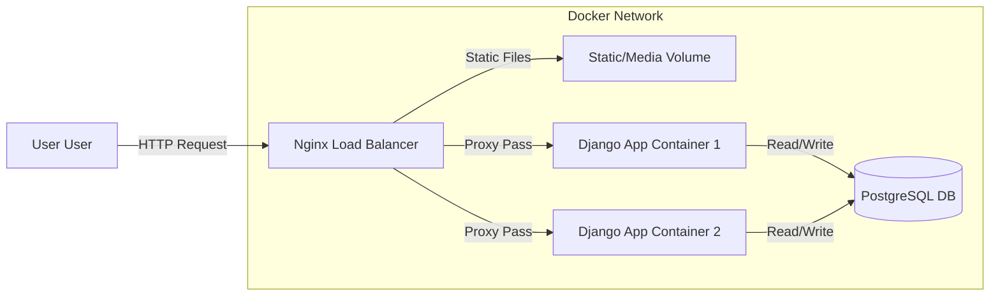

# Bloggermenia - Advanced Django Blogging Platform

## Overview
Bloggermenia is a robust, feature-rich blogging platform built with Django. It features a modern UI, AI-generated content support, playlist management for blog series, and a secure, optimized backend.

## Key Features
- **User Authentication**: Secure signup/login with Email and Google OAuth (Allauth).
- **Blog Management**: Create, Edit, Delete, and View blogs with rich text content.
- **AI Integration**: Experimental API for generating blog content using AI models.
- **Playlists**: Organize blogs into playlists (series) for better content consumption.
- **Interactive Elements**: Like blogs, view counts, and read-time estimates.
- **Optimized Backend**: efficient database queries, caching, and clean architecture.

---

# Docker Architecture & Branching Strategy

We have established a limit-testing production architecture using Docker, Nginx, and PostgreSQL.

## 1. Branching Strategy (Git Flow)

We use two primary branches to separate "Development" from "Production".

### `develop` Branch (Active Development)
- **Purpose**: Where you write code, add features, and fix bugs.
- **Environment**: Local machine, using `sqlite3` and `python manage.py runserver` (standard Django dev).
- **Configuration**: `DEBUG=True`.
- **Workflow**: You work here daily.

### `main` Branch (Production)
- **Purpose**: Stable, deployable code.
- **Environment**: Dockerized. Uses `PostgreSQL`, `Gunicorn`, and `Nginx`.
- **Configuration**: `DEBUG=False` (Production Mode).
- **Workflow**:
    1.  When a feature is done in `develop`, you merge it into `main`.
    2.  Github Actions (optional future step) or manual commands trigger a Docker build.
    3.  Production servers update.

**How to Code & Merge:**
- You code in `develop`.
- When ready, you run: `git checkout main` -> `git merge develop` -> `docker-compose up --build`.
- Config files (`Dockerfile`, `nginx.conf`) will live in `main`. Ideally, we also keep them in `develop` so they don't cause merge conflicts, but they are only *active* in the Docker setup.

## 2. Docker Production Architecture

We implemented a containerized setup using **Docker Compose**.

### The Services (Containers)

1.  **Load Balancer (Nginx)**
    -   **Role**: The Entry Point. Accepts all traffic on Port 80.
    -   **Function**:
        -   Serves **Static Files** (CSS/JS) and **Media Files** (Images) directly (Fast & Efficient).
        -   Passes traffic to the Application servers.
    -   **Load Balancing**: We will configure Nginx to distribute traffic between the 2 App Servers.

2.  **Application Servers (`web` x 2)**
    -   **Role**: Django Application.
    -   **Technology**: Gunicorn (Production WSGI Server).
    -   **Scaling**: We will run **2 Replicas** of the Django container to handle concurrent requests.
    -   **Internal Communication**: Not exposed to the internet, only accessible by Nginx.

3.  **Database (PostgreSQL)**
    -   **Role**: Production Database.
    -   **Persistence**: Data saved in a Docker Volume (safe from container restarts).
    -   **Why**: SQLite cannot handle multiple concurrent writes from 2 app servers. Postgres is required for this setup.

### Architecture Diagram


---

## Setup Instructions

### Prerequisites
- Python 3.9+
- UV (Python package manager) or Pip

### Installation

1. **Clone the repository:**
   ```bash
   git clone <repository-url>
   cd Blogermenia-Djnago
   ```

2. **Install dependencies:**
   ```bash
   uv sync
   # OR
   pip install -r requirements.txt
   ```

3. **Configure Environment:**
   Create a `.env` file in the root directory:
   ```env
   SECRET_KEY=your_secret_key
   DEBUG=True
   GOOGLE_CLIENT_ID=your_google_client_id
   GOOGLE_CLIENT_SECRET=your_google_client_secret
   ```

4. **Run Migrations:**
   ```bash
   uv run manage.py migrate
   ```

5. **Create Superuser:**
   ```bash
   uv run manage.py createsuperuser
   ```

6. **Run the Server:**
   ```bash
   uv run manage.py runserver
   ```

## Production Run (Docker)
1.  Copy `.env.prod.example` to `.env.prod` and populate secrets.
2.  Run:
    ```bash
    docker-compose up -d --build
    ```

## API Documentation

### Blog Like Toggle
- **URL**: `/api/blogs/<slug>/like/`
- **Method**: `POST`
- **Response**: `{ "liked": boolean, "total_likes": int }`
- **Optimization**: Updates counts using `F()` expressions for atomic updates.

### Upload Image
- **URL**: `/api/upload-image/`
- **Method**: `POST`
- **Body**: `multipart/form-data`, key=`image`
- **Response**: `{ "url": "string" }`

---

## Database Management

We use **PgAdmin 4** for managing the PostgreSQL database.

**Access PgAdmin:**
1.  Go to `http://localhost:5050`
2.  **Login**:
    -   Email: `admin@admin.com` (or value in `.env.prod`)
    -   Password: `root` (or value in `.env.prod`)
3.  **Connect to Server**:
    -   Click "Add New Server"
    -   Host name/address: `db` (Use the docker service name!)
    -   Username: `hello_django` (from `.env.prod`)
    -   Password: `hello_django` (from `.env.prod`)

---
*Built with ❤️ by Jay Patel*
