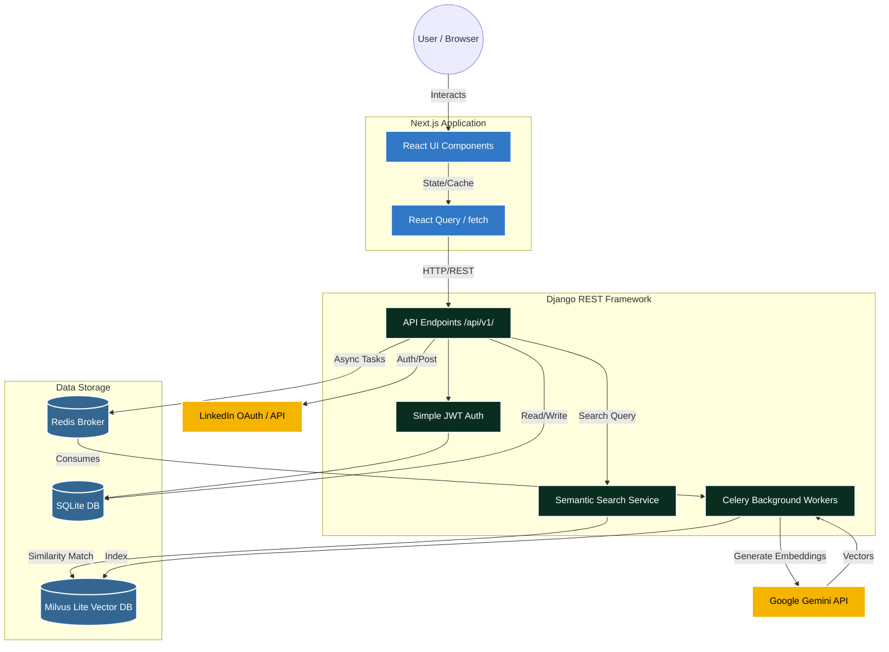

# BlogerMenia 📝

BlogerMenia is a modern, headless blogging platform that decouples a rich, interactive Next.js frontend from a robust, AI-powered Django backend. This architecture provides a fast, SEO-friendly user experience while maintaining a powerful content management and semantic search system.

---

## 🏗 System Architecture & Technical Flow

The system is split into two independent services that communicate over HTTP REST APIs:

1. **Frontend (Next.js)**: Responsible for UI, routing, and client-side state.
2. **Backend (Django/DRF)**: Responsible for the database, authentication, background tasks, and AI vector search.

### High-Level Architecture Flowchart



---

## 💻 Frontend System (Next.js)

**Path:** `/frontend`  
**Tech Stack:** Next.js (App Router), TypeScript, Tailwind CSS, React Query.

### How It Works
- **Routing & SSR:** The frontend uses Next.js App Router for page routing. It fetches data dynamically and handles Server-Side Rendering (SSR) where necessary for SEO.
- **State Management:** `react-query` handles caching, debouncing, and fetching data from the backend.
- **Authentication:** Stores JWT access and refresh tokens locally. The custom session provider attaches the `Authorization: Bearer <token>` header to outgoing API requests.
- **UI Architecture:** Built with heavily modularized React components (found in `frontend/components/`). Uses modern design aesthetics, Tailwind utility classes, and optimized responsive layouts.

---

## ⚙️ Backend System (Django REST Framework)

**Path:** `/backend`  
**Tech Stack:** Django 6.x, Python 3.13, Celery, Redis, Milvus Lite, LangChain, Google Generative AI.

### How It Works
- **API Layer:** Exposes strict RESTful endpoints (`/api/v1/`) for blogs, categories, playlists, and user profiles.
- **Authentication:** Uses `djangorestframework-simplejwt` for stateless authentication. It also supports LinkedIn OAuth for social login.
- **Database:** Uses SQLite (with WAL mode enabled) for relational data mapping (Users, Blogs, Playlists).
- **Background Tasks (Celery):** When a blog is saved or updated, Django signals fire off asynchronous tasks to Celery. This prevents the web server from blocking while waiting for long-running operations.

---

## 🧠 AI Semantic Search (How it works under the hood)

BlogerMenia features an intelligent "Semantic Search" that understands the *meaning* of your query, not just keyword matches.

1. **Indexing (Write Phase):**
   - When a user writes a new Blog or updates their Profile, a Django signal intercepts the `post_save` event.
   - It queues a Celery background task (`index_object`).
   - The Celery worker sends the text content to the **Google Gemini API** (`models/gemini-embedding-001`) to generate mathematical vectors (embeddings).
   - These vectors are stored in **Milvus Lite** (`search/milvus.db`), which is an open-source vector database.

2. **Searching (Read Phase):**
   - The user types a query in the frontend search bar. The frontend debounces the input (waits 500ms) to avoid spamming the API.
   - The query is sent to `/api/v1/search/`.
   - The Django backend instantly generates an embedding for the search phrase using Gemini.
   - It asks Milvus to find the closest matching vectors (Nearest Neighbor Search).
   - Django maps those vector IDs back to the real Blog/Playlist/User objects from the SQLite database and returns the structured JSON to the frontend.

---

## 🚀 Running the Project Locally

### Prerequisites
- Node.js & npm (for the frontend)
- Python 3.13 & `uv` (for the backend)
- Redis server running on `127.0.0.1:6379` (Required if testing Celery background tasks)
- A valid `GOOGLE_API_KEY` in `backend/.env` for embeddings.

### Start the Backend
```bash
cd backend
# The run.sh script handles starting Django. 
# By default in development, it skips Celery and runs tasks synchronously to prevent Milvus Lite database locks.
bash run.sh

# If you explicitly want to test the background Celery workers, run:
# CELERY_ENABLED=1 bash run.sh
```

### Start the Frontend
```bash
cd frontend
npm install
npm run dev
```

The frontend will be available at [http://localhost:3000](http://localhost:3000) and the backend API at [http://127.0.0.1:8000](http://127.0.0.1:8000).
