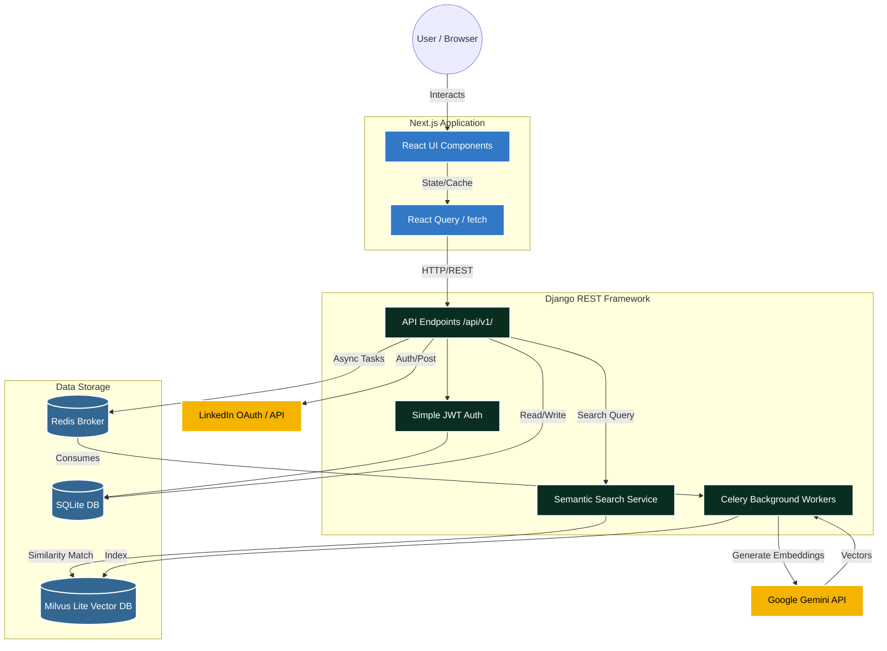

# BlogerMenia 📝

BlogerMenia is a modern, headless blogging platform that decouples a rich, interactive Next.js frontend from a robust, AI-powered Django backend. This architecture provides a fast, SEO-friendly user experience while maintaining a powerful content management and semantic search system.

---

## 🏗 System Architecture & Technical Flow

The system is split into two independent services that communicate over HTTP REST APIs:

1. **Frontend (Next.js)**: Responsible for UI, routing, and client-side state.
2. **Backend (Django/DRF)**: Responsible for the database, authentication, background tasks, and AI vector search.

### High-Level Architecture Flowchart



---

## 💻 Frontend System (Next.js)

**Path:** `/frontend`  
**Tech Stack:** Next.js (App Router), TypeScript, Tailwind CSS, React Query.

### How It Works
- **Routing & SSR:** The frontend uses Next.js App Router for page routing. It fetches data dynamically and handles Server-Side Rendering (SSR) where necessary for SEO.
- **State Management:** `react-query` handles caching, debouncing, and fetching data from the backend.
- **Authentication:** Stores JWT access and refresh tokens locally. The custom session provider attaches the `Authorization: Bearer <token>` header to outgoing API requests.
- **UI Architecture:** Built with heavily modularized React components (found in `frontend/components/`). Uses modern design aesthetics, Tailwind utility classes, and optimized responsive layouts.

---

## ⚙️ Backend System (Django REST Framework)

**Path:** `/backend`  
**Tech Stack:** Django 6.x, Python 3.13, Celery, Redis, Milvus Lite, LangChain, Google Generative AI, ReportLab.

### How It Works
- **API Layer:** Exposes strict RESTful endpoints (`/api/v1/`) for blogs, categories, playlists, and user profiles.
- **Authentication:** Uses `djangorestframework-simplejwt` for stateless authentication. It also supports LinkedIn OAuth for social login.
- **Database:** Uses SQLite (with WAL mode enabled) for relational data mapping (Users, Blogs, Playlists).
- **Background Tasks (Celery):** When a blog is saved or updated, Django signals queue asynchronous tasks on commit, so the web server never blocks on Gemini. Dispatch is guarded: if Redis is unreachable the save still succeeds and the periodic sweep picks the work up.
- **Structure & conventions:** See [`backend/backend.md`](backend/backend.md) — layer responsibilities, the `api.py` naming rule, and the handful of DRF behaviours that are easy to get wrong.

---

## 📄 PDF export & the LinkedIn document share

A post renders to a real PDF server-side, built from its structured sections by
ReportLab (`blog/services/pdf_service.py`). There is exactly one such file per
revision and two consumers of it:

- `GET /api/v1/blogs/<slug>/pdf/` — what the "View PDF" button on the post opens,
  through the Next.js BFF at `/api/blogs/<slug>/pdf/`. Drafts are visible to
  their author only, on the same `visible_blogs` queryset the detail view uses.
- The LinkedIn share, which uploads those same bytes through LinkedIn's
  Documents API so the post appears in the feed as a readable carousel rather
  than a bare link.

The render is memoised on the post's `updated_at`, so previewing a PDF and then
sharing it costs one render, and an edit invalidates the old one by itself.

The commentary beside the document is short on purpose — LinkedIn folds anything
long behind "…see more". It carries the title, one or two sentences from the
excerpt (cut on a word boundary), the canonical URL, and up to five of the post's
tags as hashtags, normalised to characters LinkedIn will actually link. The URL
sits in the text because a post can carry a document *or* a link preview, never
both, and LinkedIn auto-links a URL it finds in the words.

Every step of the attachment can fail without costing the share: a failed render
or upload falls back to a text post, and a post LinkedIn rejects *with* a
document is retried once without it. Only a text post LinkedIn refuses is raised
for `RETRY_POLICY` to handle. See `accounts/services/linkedin_share.py`.

---

## 🧠 AI Semantic Search (How it works under the hood)

BlogerMenia features an intelligent "Semantic Search" that understands the *meaning* of your query, not just keyword matches.

1. **Indexing (Write Phase):**
   - When a user writes a new Blog or updates their Profile, a Django signal intercepts the `post_save` event.
   - It queues a Celery background task (`index_object`).
   - The Celery worker sends the text content to the **Google Gemini API** (`models/gemini-embedding-001`) to generate mathematical vectors (embeddings).
   - These vectors are stored in **Milvus Lite** (`search/milvus.db`), which is an open-source vector database.
   - The outcome is recorded on the post itself (`embedding_status`, `embedding_error`, `embedded_at`) and shown in the Django admin, so a post missing from search is diagnosable rather than silently absent.
   - A content hash means a re-save that changed nothing indexable skips the (billed) round trip, and a six-hourly sweep retries anything left pending or failed.

2. **Searching (Read Phase):**
   - The user types a query in the frontend search bar. The frontend debounces the input (waits 500ms) to avoid spamming the API.
   - The query is sent to `/api/v1/search/`.
   - The Django backend instantly generates an embedding for the search phrase using Gemini.
   - It asks Milvus to find the closest matching vectors (Nearest Neighbor Search).
   - Django maps those vector IDs back to the real Blog/Playlist/User objects from the SQLite database and returns the structured JSON to the frontend.
   - Results are cached per query and the endpoint is rate limited: every call costs a Gemini embedding, so identical queries must not pay twice.

---

## 🚀 Running the Project Locally

### Prerequisites
- Node.js & npm (for the frontend)
- Python 3.13 & `uv` (for the backend)
- Redis server running on `127.0.0.1:6379` (required if testing Celery background tasks)
- A valid `GOOGLE_API_KEY` in `backend/.env` for embeddings

Both apps read their configuration from `.env`; each ships a committed
`.env.example` listing every variable. In production `DJANGO_ENV=prod` switches
`config/settings/prod.py` in, which refuses to boot without a real
`DJANGO_SECRET_KEY` and `DJANGO_ALLOWED_HOSTS`.

### Start the Backend
```bash
cd backend
cp .env.example .env          # then fill in GOOGLE_API_KEY
uv sync

uv run python manage.py migrate

# Everything at once — checks Redis, then starts the Celery worker, beat,
# Flower (task monitoring on :5555) and the Django dev server.
uv run python manage.py dev

# Or just Django. Tasks then run eagerly in-process: Milvus Lite holds a file
# lock on the vector index, so a worker and the web process cannot both open it.
uv run python manage.py runserver
```

Useful URLs once it is up:

| URL | What |
| --- | --- |
| `/api/v1/health/` | Health check — database, cache (`?deep=1` also opens the vector store) |
| `/api/docs/` | Swagger UI, generated from the serializers |
| `/api/schema/` | The OpenAPI document itself |
| `/admin/` | Django admin. `Blog` shows each post's search-index status |

### Start the Frontend
```bash
cd frontend
cp .env.example .env.local    # API_BASE_URL points at the Django API
npm install
npm run dev
```

The frontend will be available at [http://localhost:3000](http://localhost:3000) and the backend API at [http://127.0.0.1:8000](http://127.0.0.1:8000).
